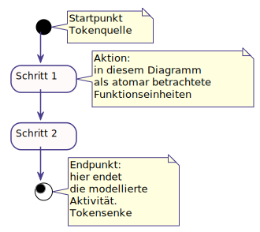

Diagramm zur Verhaltensmodellierung
===================================

Ein UML-Aktivitätsdiagramm (*Activitydiagram*) beschreibt, wie das
Verhalten eines (Software)-System *realisiert* ist. Es erweitert die
Ausdrucksmöglichkeiten gegenüber einfacheren Flussdiagrammen wie dem
Programmablaufplan. Im Aktivitätsdiagramm können Daten- und
Kontrollflüsse modelliert werden, z.B. von

-   Algorithmen,

-   Geschäftsprozessen oder

-   Workflows.

Im Fokus steht die Modellierung der Abfolge (sequenziell oder parallel),
Bedingungen, Verzweigungen, Wiederholungen sowie Anfang und Ende von
Aktivitäten. Alle Schritte können zudem in Verantwortungsbereichen
konkreten Akteurinnen oder Systemen zugewiesen werden.

Das Tokenmodell im Flussdiagramm: mit Knoten und Kanten
=======================================================
Aktivitätsdiagramme bestehen aus **Knoten** und **Kanten**.
Sie nutzen das Tokenmodell: ein *Token* ist eine gedachte Markierung
(*Token*) kennzeichnet die momentan ausgeführten Aktionen - vergleichbar
mit dem springenden Punkt beim Karaokesingen. Ein Token wird im
Startpunkt (*initial node*) erzeugt und durchläuft das Diagramm entlang
der Kanten (Pfeile, *edges*). Im Endpunkt (*activity final node*) wird
der Token konsumiert und die Aktivität so beendet.

Ein minimales mit PlantUML modelliertes Aktivitätsdiagramm, das einen
unverzweigte Aktivität darstellt, ist rechts dargestellt.




Hinweis: Den meisten Diagrammen in diesem Dokument sind Links zu den
zugrundeliegenden Vektorgrafiken und Quelltexten hinterlegt. Der die
komplette URL öffnet das Diagramm, die zweite Hälfte (nach src=) den
Quelltext.

[https://www.plantuml.com/plantuml/proxy?fmt=svg&src=https://www.quelltext.url/source.plantuml](http://www.plantuml.com/plantuml/proxy?fmt=svg&src=https://raw.githubusercontent.com/hannsens/plantUML-Activity-Infosheet/master/plantuml/01_aktion_start_stop.plantuml)

p7cm p10cm

&

``` {style="plantuml"}
@startuml 'Muss immer am Anfang stehen
start
:Schritt 1;
:Multiline
    Schritt **2**;
stop
@enduml
```

Kontrollstrukturen: Verzweigung und Vereinigung
===============================================

Neben dem rein sequenziellen unverzweigten Ablauf können auch bedingte
Anweisungen modelliert werden. Verzweigungen werden als
Entscheidungsknoten (*decision node*) mit dem Raute-Symbol notiert. Die
Bedingungen selbst werden als *guard* bezeichnet und -abweichend vom
Programmablaufplan- in eckigen Klammern an der jeweiligen Kante notiert.
Die Bedingungen müssen als Prädikat formuliert sein - also mit *true*
oder *false* auswertbar sein. Sie sollten *disjunkt* sein (sich
gegenseitig ausschließen), um ein vorhersagbares Verhalten zu
modellieren. Bei einfachen Verzweigungen erreicht man das, in dem zu
jeder Bedingung ein `[else]`-Zweig modelliert wird.

p7cm p10cm

& Bei PlantUML ist die Notation etwas gewöhnungsbedürftig: die erste
Bedingung wird hinter `then()` in Klammern notiert, den `else`-Block
sollte man in jedem Fall notieren:

``` {style="plantuml"}
if() then ([Geld ausreichend])
    :kaufe Produkt;
else ([else])
endif
```

Im Gegensatz zum Programmablaufplan werden die verschiedenen Kanten
einer Verzweigung auch wieder an einer Raute (*merge node*)
zusammengeführt. Weder ein *decision node* noch ein *merge node* ändern
die Anzahl der vorhandenen Token.

p7cm p10cm

&

``` {style="plantuml"}
start
if() then ([Code fehlerfrei])
    :Code compilieren;
else ([else])
    :Fehlermeldung erstellen;
endif
stop
```

Nicht alle Bedingungen lassen sich unmittelbar als Prädikat formulieren.
Sofern nähere Eräuterungen nötig sind sieht die UML vor, dass diese über
eine Notiz mit dem Stereotyp `<<decision input>>` erfolgt, die mit der
*decision node* verbunden wird.

In PlantUML gibt es diese Möglichkeit nicht, daher muss man sich mit
einer Notiz, die neben der vorigen Aktion steht, behelfen. Gemäß UML
wird innerhalb der *decision node* nichts notiert - hier weicht die
PlantUML-Dokumentation vom UML-Standard ab.

p7cm p10cm &

``` {style="plantuml"}
note right
    <<decision input>>
    Ist hinreichend 
    Bonität vorhanden?
end note
if() then ([true])
    :Kaufvertrag abwickeln;
else ([false])
    :zunächst Beratung anbieten;
endif
```

Mehrfache Verzweigungen können durch mehr Kanten realisiert werden, die
den *decision node* verlassen. Wichtig ist auch hier, dass die *guards*
disjunkt sind.

Leider bietet PlantUML nur die Möglichkeit, zwei ausgehende Kanten an
einer *decision node* zu nutzen. Daher müssen multiple Bedingungen als
verschachtelte If-Statements modelliert werden:

p7cm p10cm

&

``` {style="plantuml"}
if() then ([Taste A])
    :Bewegung nach links;
elseif() then ([Taste D])
    :Bewegung nach rechts;
else ([else])
    :ignorieren;
endif
```

Wiederholungsstrukturen: kopf- und fussgesteuerte Schleifen
===========================================================

Eine nachgelagerte Bedingung, die eine Wiederholung bestimmter Aktionen
erzwingt wird über die Rückführung der ausgehenden Kante mit *guard*
einer *decision node* modelliert. Bei diesen fussgesteuerten Schleifen
werden die Aktionen innerhalb der Schleife in jedem Fall einmal
ausgeführt. Mit PlantUML erfolgt die Modellierung mit einem
`repeat / repeat while () is ([ `*guard* `])`-Block:

p7cm p10cm

&

``` {style="plantuml"}
start
repeat
    :Stufe hochsteigen;
repeat while () is ([else])
->[oben angekommen];
stop

```

Im Fall einer kopfgesteuerten Schleife wird die Bedingung zunächst
geprüft, die zu wiederholenden Aktionen also ggf. nie ausgeführt.

p7cm p10cm

&

``` {style="plantuml"}
start
while() is ([hungrig])
    :Brot schmieren;
    :Brot essen;
endwhile ([satt])
stop
```

Concurrency: Parallelisierung von Aktionen (Splitting und Synchronisation)
==========================================================================

Im Gegensatz zu einem *decision node* oder *merge node* müssen bei
Gabelungen (*fork node*) oder Synchronisierung (*join node*) an allen
eingehenden Kanten ein Token anliegen, damit sie wiederum Token
weiterreichen. Entsprechend werden an allen ausgehenden Kanten dann
Token weitergereicht. Auf diese Art werden parallele Prozesse und
Synchronisierungen modelliert.

p7cm p10cm

&

``` {style="plantuml"}
start
fork
    :Mache dies;
fork again
    :...und mache 
    gleichzeitig das;
end fork
stop

    
```

Partitionen / Swimlanes zur Unterscheidung von Verantwortungsbereichen
======================================================================

Die UML sieht vor, dass modelliert werden kann, welche Akteurin oder
welches System für bestimmte Aktionen verantwortlich oder
organisatorisch Zuständig ist. Aufgrund des Aussehens werden diese
Verantwortungsbereiche, die die UML *partition* nennt, oft *swimlanes*
genannt.

p7cm p10cm

&

``` {style="plantuml"}
'Durch Nennung Reihenfolge festlegen
|Geschäftsführer|
|Fachabteilung|
|Kunde|
    start
|Kunde|
    :Lastenheft;
|Fachabteilung|
    :Pflichtenheft;
|Geschäftsführer|
    :Angebot auf 
    Pflichtenheft 
    basierend;
|Kunde|
    :Angebotsprüfung;
    :Vertragsabschluss;
    stop
```

Signale/ Ereignisse senden und empfangen; Objektflüsse darstellen
=================================================================

Token können nicht nur aus einem Startknoten entspringen, sondern auch
über Signale erzeugt werden, die in einer *accept event action*
empfangen werden. Sofern dieser Signalempfängerknoten auch eingehende
Kanten hat, wird der ausgehende Token erst gefeuert, wenn ein Token
anliegt und ein Signal eingeht. Der Token wandert dann wie gewohnt
entlang der Kanten von Knoten zu Knoten. Signale können auch gesendet
werden. Beim erreichen einer *send signal action* wird asynchron das
Signal gesendet und die nächste Aktion bearbeitet. Es wird nicht auf
Antwort oder Empfangsbestätigung gewartet.

Sofern nicht der Kontrollfluss symbolisiert werden soll, sondern
konkrete Daten, so wird ein Objektknoten als Rechteck notiert. An den
ein- und ausgehenden Kanten wird anstelle eines abstrakten Tokens dann
ein Objekt transportiert.

p7cm p10cm

&

``` {style="plantuml"}
    
:HTTP-POST-Request<
:Message Header + Body]
:Nachricht verarbeiten und 
    Antwortnachricht erzeugen;
:Response]
:sende Response>
stop
```

Ablaufende
==========

Wenn das Erreichen eines Endes zwar den aktuellen Ausführungsstrang
beendet - also den eingetroffenen Token konsumiert - aber in der
Gesamtaktivität noch weitere Token vorhanden sein können, muss ein
Ablaufende ()*activity final node*) modelliert werden. Im Gegensatz zu
einem *activity final node* werden nicht alle vorhandenen Token
konsumiert, sondern nur der am *activity final node* eintreffende Token.

p7cm p10cm

&

``` {style="plantuml"}
start
fork
    :atmen;
fork again
    :denken;
fork again
    :singen;
    end
end fork
stop
```

Konnektoren (Sprungmarken) zur übersichtlicheren Darstellung
============================================================

Um Kreuzungen zu vermeiden oder um komplexere Zusammenhänge
übersichtlicher darstellen zu können, können Sprungmarken (A) verwendet
werden. Abläufe können dadurch unterbrochen werden (bei PlantUML mit
`detach`) und in gesonderten Aktivitätsdiagrammen ausgeführt werden.

p7cm p10cm

&

``` {style="plantuml"}
start
fork
    (A)
    detach
    (B)
fork again
    :Mach' das;
end fork 
stop


(A)
repeat
    :immer wieder das;
repeat while () is ([weiter])
->[aufhören];
(B)
```

Vor- und Nachbedingungen
========================

Aktionen können mit Vor- und Nachbedingungen versehen werden. Diese
werden jeweils als Notiz mit dem jeweiligen Stereotyp notiert:

-   \<\<localPrecondition\>\>: Diese Bedingungen müssen vor Eintritt in
    die Aktion erfüllt sein

-   \<\<localPostcondition\>\> : Diese Bedingungen müssen vor Beendigung
    der Aktion erfüllt sein

p7cm p10cm

&

``` {style="plantuml"}
start
:Schritt 1; 
note right 
    <<localPrecondition>>
    Diese Vorbedingung muss <b>vor</b> 
    Ausführung dieser Aktion erfüllt sein
    ====
    <<localPostcondition>>
    Diese Nachbedingung muss <b>nach</b>
    Ausführung dieser Aktion erfüllt sein
end note
stop
    
```

plantUML-Webservice
===================

PlantUML bietet einen Webservice, der Diagramme unmittelbar online
rendert.

Variante 1: der PlantUML-Quelltext ist online als Resource verfügbar und
soll gerendert ausgegeben werden. Hierzu muss eine URL nach dem Muster:

[http://www.plantuml.com/plantuml/proxy?fmt=AUSGABEFORMAT&src=https://URL\_PLANTUMLSOURCE](http://www.plantuml.com/plantuml/proxy?fmt=epstxt&src=https://raw.githubusercontent.com/hannsens/plantUML-UseCase-InfoSheet/master/plantuml/01_Bestandteile_UseCase.plantuml)

erstellt werden, wobei als *AUSGABEFORMAT* `png`, `svg`, `eps`,
`epstext` und `txt` genutzt werden kann.\
Variante 2: PlantUML kodiert den Quelltext, um ihn so über den
Webservice zugänglich (und bearbeitbar) zu machen. Die URL ist in diesem
Fall wie folgt aufgebaut:

[http://www.plantuml.com/plantuml/AUSGABEFORMAT/CODIERTERQUELLTEXT](http://www.plantuml.com/plantuml/uml/fPA_JWCn3CPdyXHM5yfmBr09gVy40rMNWX28nStvxg9BdCfnE07YtScfAdHWWcon_VtysSayAOhcu4tg7HzGCC2Q6inURoBh5WF1P9Ejgn5so0dktmuqY5EIYJdJF2HQOQ8F0-KiezGag-YZm1gbttbKMlfCnopQlfMOkJvM35sXfH1xCfzdn6tKF-4shktqYRoFG-6T0HTMe_pRu3bG90w_GSpbBJ59yG3lES264Z6yHXwtL8rhgjOEsu889KwE6xGToSnuQXGqWemZGEs4hBh8XRVebR8uXeQIUcgBpk0u3ypkYa_7Cy04DYUDWQG8JWy2DJMENJ73C0rEuPcS9yvXBzbsyCBNMngyOxeoEP4T5TD752ePs9TUPGRYgn7-VJFcr0UgwYTy0SRCYUlobxu0)

wobei als *AUSGABEFORMAT* `png`, `svg`, `eps`, `epstext` und `txt`
genutzt werden kann. Wird als *AUSGABEFORMAT* `uml` gewählt erhält man
den bearbeitbaren Quelltext.

Editierbare Links lassen sich auch über den Service von planttext.com
erstellen, sie nutzen die selbe Quelltextcodierung und URLs nach dem
Muster:
[https://www.planttext.com/?text=CODIERTERQUELLTEXT](https://www.planttext.com/?text=bPBFJW8n4CRlVOg9Bs2ywhe199u8CS6OU2pjiDjijqEcKpQ4y6RUV35Ry028YVOuVxxVV5ywYg9PKkzLx5nOQzOzJ76bavTd2ZBNFSBDB1bdDInqYF2wNUF0Jf1lrCdEs8ZREDdk5EGtqQPhc5AmJ-I98GOQZWrYYtmiJZLt2wy59pxXeJjrkgTWBxURbg8CRMQUJVqgfVOdXyr9SFS7zYLqvffMtj7xVFd-p2ap3LUnwf2bkb-ODWSaSFS0AcGySD620wQgF1djNnXDzk34KQZhRriO4Tw8bsXTQ59ee4ynGhMiDyJLxR8-AenJN7r-j5m6RDbX67T51v1pmtk1Y2wen_pEa3d4wyovDkrFQCZLGlqN58E5OZb7GMi5EPDHBfNlzGK0)

Auch in den erzeugten PNG-Dateien wird der codierte Quelltext als Titel
hinterlegt, so dass sie sich relativ einfach später weiterverarbeiten
lassen.

plantUML-Formatierung: Aufhübschen von Aktivitätsdiagrammen
===========================================================

Wenn die Diagramme erstmal stehen will man sie aufhübschen. Dafür stehen
allerlei möglichkeiten zur Verfügung, die v.a. auf der plantUML-Seite
dargestellt werden. Einige Beispiele sind hier abgebildet:\

+:----------------------+:----------------------+:----------------------+
| Minimalbeispiel       | Anpassung von         | Sieht nach Entwurf    |
|                       | Schriftart und Farben | aus: um die           |
|                       |                       | Vorläufigkeit und     |
|                       |                       | Änderbarkeit zu       |
|                       |                       | unterstreichen kann   |
|                       |                       | man es nach einer     |
|                       |                       | Skizze aussehen       |
|                       |                       | lassen.               |
+-----------------------+-----------------------+-----------------------+
| ``` {style="plantuml" | ``` {style="plantuml" | ``` {style="plantuml" |
| }                     | }                     | }                     |
| @startuml             | @startuml             | @startuml             |
| |Customer|            | skinparam DefaultFont | ' Welche Schriften gi |
| |Dev|                 | Name "Lucida Sans Typ | bt es auf dem System? |
| |QM|                  | ewriter"              | ' listfonts als plant |
| |Customer|            |                       | UML-Kommando gibt's a |
| start                 | skinparam Activity{   | us.                   |
| repeat                | BackgroundColor snow  | skinparam DefaultFont |
| :add Requirment;      | BorderColor DarkSlate | Name "FG Virgil"      |
| |Dev|                 | Blue                  | skinparam handwritten |
| fork                  | DiamondBackgroundColo |  true                 |
| :ask Customer>        | r ghostwhite          | skinparam monochrome  |
| Detach                | DiamondBorderColor Da | true                  |
| :get response<        | rkSlateBlue           | skinparam packageStyl |
| fork again            |                       | e rect                |
| :test;                | }                     | skinparam shadowing f |
| fork again            | skinparam Note{       | alse                  |
| :deploy;              | BorderColor DarkSlate |                       |
| end                   | Blue                  |                       |
| fork again            | BackgroundColor Light | |Customer|            |
| |QM|                  | Yellow                | |Dev|                 |
| :Review;              | }                     | |QM|                  |
| end fork              |                       | |Customer|            |
| |Customer|            | skinparam ArrowColor  | start                 |
| repeat while () is ([ | DarkSlateBlue         | ...                   |
| open tasks])          | |Customer|            | stop                  |
| ->[finished];         | |Dev|                 | @enduml               |
| |Dev|                 | |QM|                  | ```                   |
| stop                  | |Customer|            |                       |
| @enduml               | start                 |                       |
|                       | ...                   |                       |
| ```                   | stop                  |                       |
|                       | @enduml               |                       |
|                       | ```                   |                       |
+-----------------------+-----------------------+-----------------------+

9 , Dokumentation\
[   https://www.plantuml.com/](   https://www.plantuml.com/) , Website,
auf der direkt plantUML-QUelltexte geparst werden können:\
<https://www.planttext.com/>
